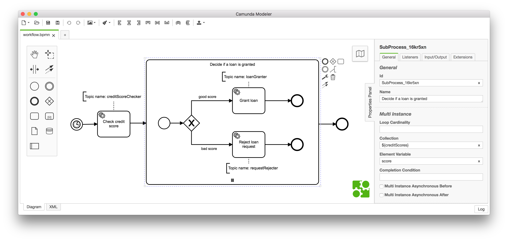
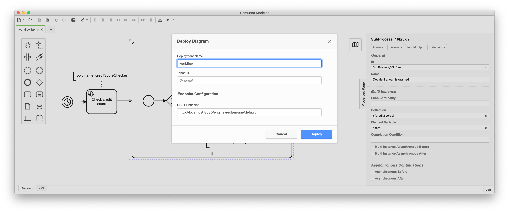
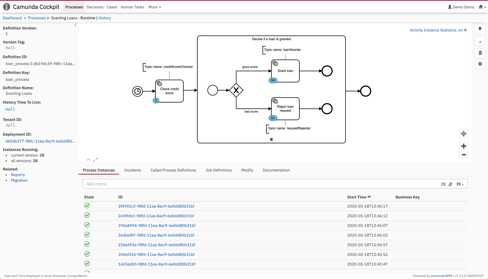

# Camunda External Task Client (Java) Example

In this tutorial you will learn how to use the External Task client for Java.

In a nutshell you will be guided through the following steps:
* Starting the Camunda BPM Platform
* Modeling and Deploying a workflow with the Camunda Modeler
* Bootstrapping the External Task client
* Monitor the workflow in Camunda Cockpit

## Prerequisites
* [Java JDK 8+](http://www.oracle.com/technetwork/java/javase/downloads/jdk8-downloads-2133151.html)
* [Apache Maven](https://maven.apache.org/download.cgi)
* [Camunda Modeler >= 1.12.0](https://camunda.org/release/camunda-modeler/1.12.0/)
* [Camunda BPM Platform >= 7.9.0](https://camunda.org/release/camunda-bpm/tomcat/7.9/camunda-bpm-tomcat-7.9.0.zip)
* Camunda External Task Client

First, make sure that you have downloaded and installed all the necessary prerequisites.

## Start the Camunda BPM Platform
* Microsoft Windows users need to run the `start-camunda.bat` file
* Users of Unix based operating systems need to run the `start-camunda.sh` file

## Model a Workflow

Open the Camunda Modeler, create a new BPMN diagram and model the following simple workflow:



1. Once a process instance is started, an External Task instance with the name "creditScoreChecker" is created
2. The External Task client will start to fetch and lock the External Task instances
3. Once the External Task client has performed some work based on the fetched task, 
these task is completed and the result is sent to the Workflow Engine in the form of a list containing all credit scores
4. For each list entry a new instance of the subprocess is created
5. According to the respective credit score, a path of the exclusive gateway is selected
6. Based on the selection, further External Task topics are created

> **Note:** make sure to set the properties for the respective notation elements in the properties panel correctly

You can download the BPMN 2.0 XML of the workflow [here](https://raw.githubusercontent.com/camunda/camunda-external-task-client-java/master/examples/loan-granting/workflow.bpmn).

## Deploy a Workflow

Next, we want to deploy the model to the Camunda BPM Platform. To do so, simply click on the "Deploy" icon 
 in the Camunda Modeler and select "Deploy Current Diagram". 
A dialog appears where a deployment name can be selected. Feel free to select a name of your choice!



To complete the deployment click on the "Deploy" button. Your model is now ready to be executed by the **Camunda BPMN Workflow Engine**.

## Set Up a Project
In this step we will set up the External Task client.

You can create a new Maven project using your IDE, or run the following command:

```sh
mvn archetype:generate \
    -DgroupId=org.camunda.bpm \
    -DartifactId=loan-granting \
    -DarchetypeArtifactId=maven-archetype-quickstart \
    -DinteractiveMode=false
```

Add the `camunda-external-task-client` dependency to the project's `pom.xml`:
```xml
<dependency>
  <groupId>org.camunda.bpm</groupId>
  <artifactId>camunda-external-task-client</artifactId>
  <version>1.0.0</version>
</dependency>
```

Create a main class and add the following lines:
```java
// bootstrap the client
ExternalTaskClient client = ExternalTaskClient.create()
  .baseUrl("http://localhost:8080/engine-rest")
  .build();

// subscribe to the topic
client.subscribe("creditScoreChecker")
  .lockDuration(1000)
  .handler((externalTask, externalTaskService) -> {

    // retrieve a variable from the Workflow Engine
    int defaultScore = externalTask.getVariable("defaultScore");

    List<Integer> creditScores = new ArrayList<>(Arrays.asList(defaultScore, 9, 1, 4, 10));

    // create an object typed variable
    ObjectValue creditScoresObject = Variables
      .objectValue(creditScores)
      .create();

    // complete the external task
    externalTaskService.complete(externalTask,
      Collections.singletonMap("creditScores", creditScoresObject));

    System.out.println("The External Task " + externalTask.getId() + " has been completed!");

  }).open();

Thread.sleep(1000 * 60 * 5);
```

Now, just run your application. The client starts to continuously fetch and lock for External Task instances.

You should see a similar result in your console window:
```sh
The External Task 1d375217-2cfe-11e8-96c2-769e8e30ca9b has been completed!
The External Task 0857150d-2cfe-11e8-96c2-769e8e30ca9b has been completed!
The External Task f3779b51-2cfd-11e8-96c2-769e8e30ca9b has been completed!
...
```

## Monitor the Workflow in Camunda Cockpit
Open [Camunda Cockpit](http://localhost:8080/camunda/app/cockpit) click in the top navigation on "Processes" and then
on the process "Granting Loans". You should see the workflow with the activity instances:


Now it is your turn: try to subscribe with the **Camunda External Task Client (Java)** either to the topic "loanGranter" 
or "requestRejecter" and complete some tasks.
