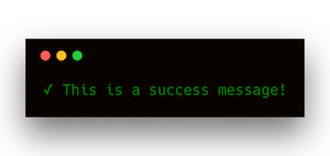
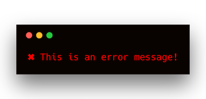

# logger

A logger is a simple middleware that logs various events in the client lifecycle. It can be configured using different log-levels.

```js
const { Client, logger } = require("camunda-external-task-client-js");

const client = new Client({
  use: logger,
  baseUrl: "http://localhost:8080/engine-rest"
});
```

## `logger.level(logLevel)`
Returns a logger instance with the configured log level.
```js
const { Client, logger } = require("camunda-external-task-client-js");

const client = new Client({
  use: logger.level('debug'),
  baseUrl: "http://localhost:8080/engine-rest"
});
```

The levels correspond to the npm logging levels:

```JSON
{
  error: 0,
  warn: 1,
  info: 2,
  verbose: 3,
  debug: 4,
  silly: 5
}
```

If you do not specify a log level, `info` will be used.


## `logger.success(text)`

Receives a text and produces a success message out of it.

```js
console.log(logger.success("This is a success message!"));
```




## `logger.error(text)`
Receives a text and produces an error message out of it.

```js
console.log(logger.error("This is an error message!"));
```


