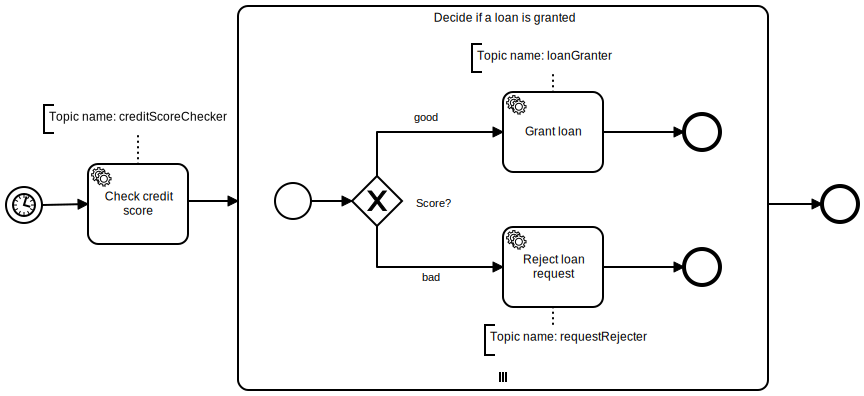
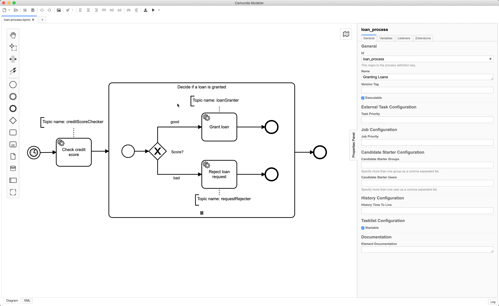

# Example
> NodeJS >= v18 is required



## Running the example

1. First, make sure to have [Camunda](https://camunda.com/download/) running.

2. Download the following [model](assets/loan-process.bpmn) and deploy it using the Camunda Modeler.



3. Install Dependencies:

```sh
npm install
```

Or:

```sh
yarn
```

4. Run the example:
```sh
node index.js
```

### Output
The output should be:

```
✓ subscribed to topic creditScoreChecker
✓ completed task 897ce191-2dea-11e8-a9c0-66b11439c29a
```
