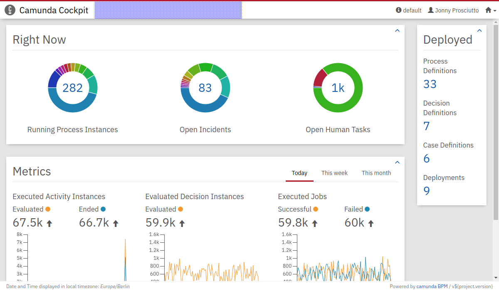
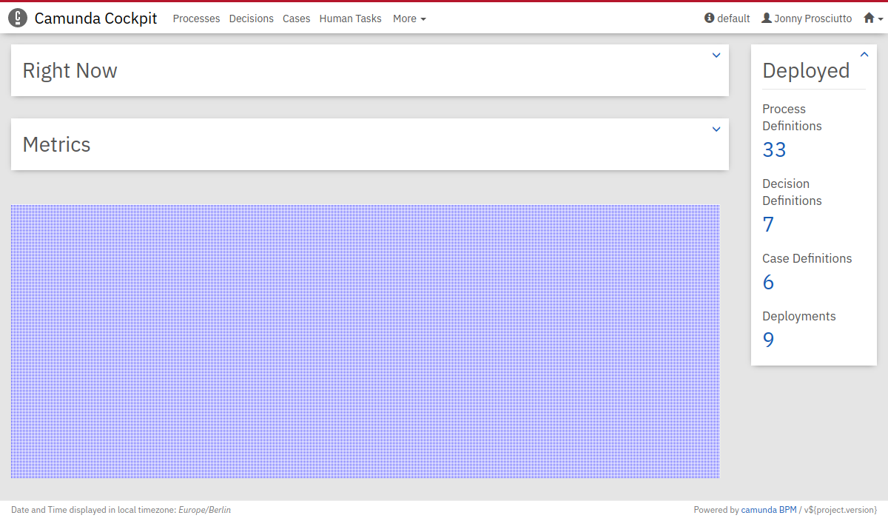
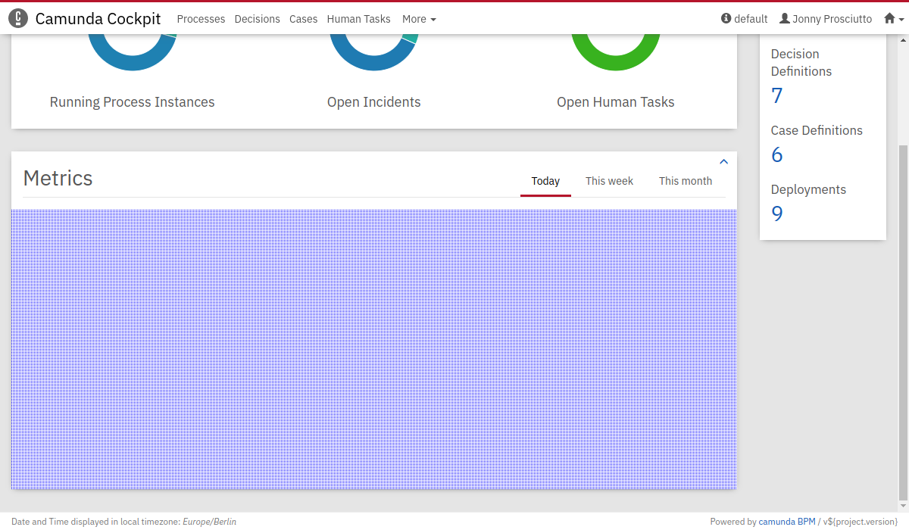
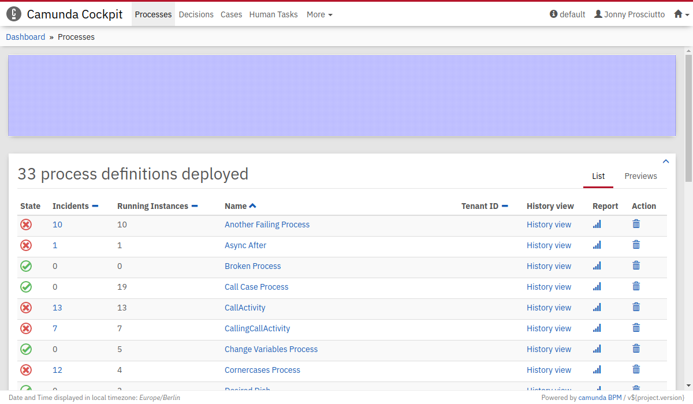
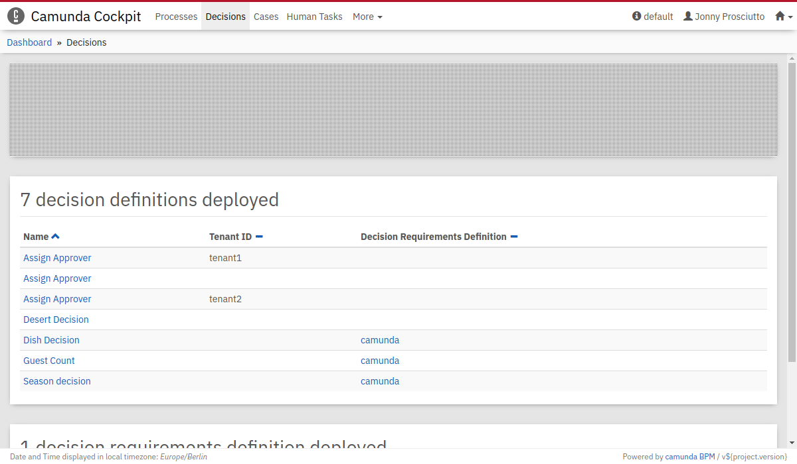
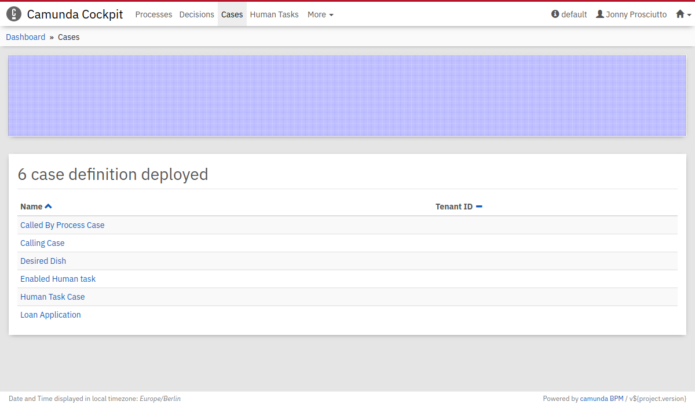
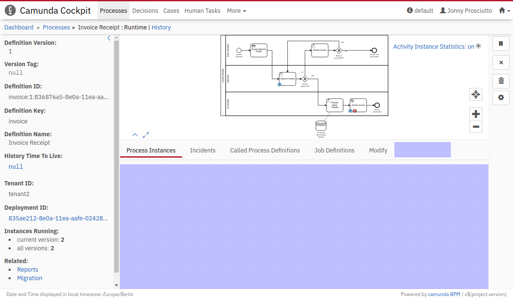
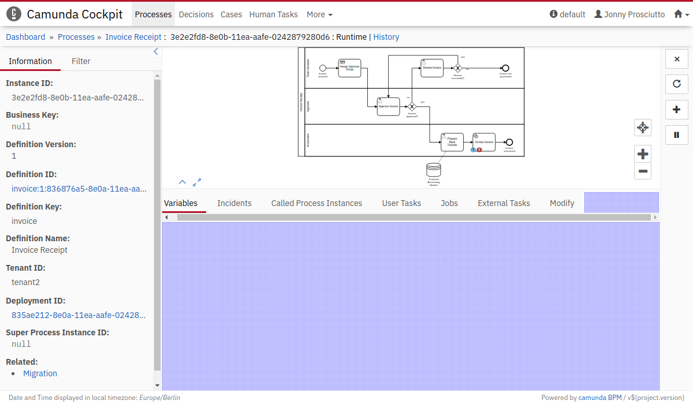
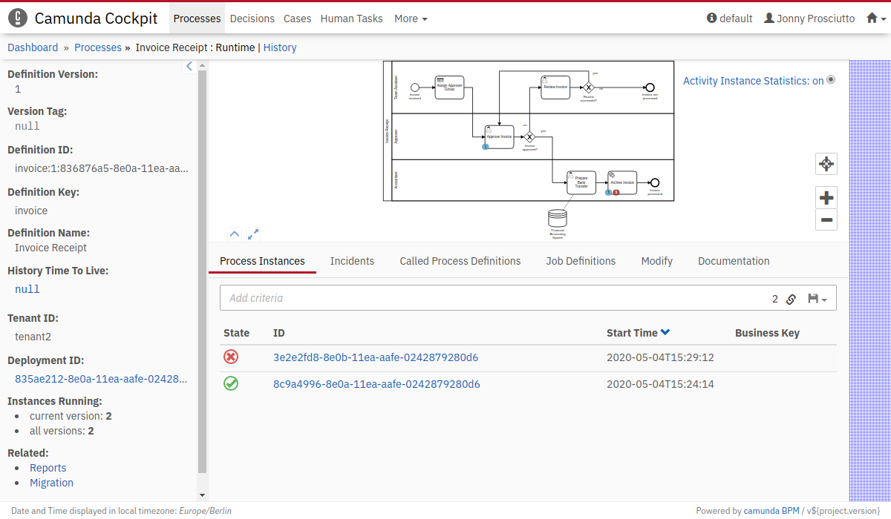

# The Nature of a Cockpit Plugin
## Structure of a User Plugin

A custom plugin always follows the same structure. This is how a sample `plugin.js` could look like.

```Javascript
export default {
  id: "externalPlugin",
  pluginPoint: "cockpit.dashboard",
  priority: 5,
  render: container => {
    container.innerHTML = "My Plugin";
  }
};
```
### Important things about the structure:
 1. The File is an JavaScript module (ES module).
 2. The default export is either a Plugin or an array of Plugins. Only the default export is used by Camunda Cockpit.

### Attributes in Detail
`id`: A string which defines this Plugin. Should be unique across the Application. This can be used to exclude Plugins later on.

`pluginPoint`: String, describes where the Plugin is rendered. This also defines which parameters are passed into the render function, see [PluginPoints](#plugin-points)

`priority`: Number, describes in which order the plugins at the same pluginPoint will be mounted. For certain Plugin points (like cockpit.navigation), a negative priority hides the entry in a dropdown. How this is handled depends on the Plugin Point.

`render`: Function, the heart of your Plugin. Arguments are (`DOMNode`|`BPMNioViewerInstance`, additionalData (`Object`)). The function **must not return anything**. Using the Node, render your Plugin into the DOM.
The second argument contains constants like a processDefinitionId. The details of which data is passed into the Plugin can be found at the PluginPoint definition.

`unmount`: Optional function which is called when the Plugin is unmounted. Use this to cleanup any listeners you or your Framework might have registered.

`label`: Optional, String. Displayed as heading for a tab or menu entry.

## Plugin Inclusion
Add the JavaScript file to your application server. In the `config.json` of cockpit, add the path to your file to the `customScripts` array. Example:

```JSON
{
  "customScripts": ["customScript.js", "path/to/another/plugin.js"],
  "locales": ["en"]
}
```

# Plugin Points
The IDs of the Plugins have not changed. As long as we don't have screenshots here, the [old documentation](https://docs.camunda.org/manual/7.12/webapps/cockpit/extend/plugins/#plugin-points) can be used.

Plugin Points describe where a Plugin will be rendered. It also defines which data, if any, is passed into the second argument of the render Function. The list of additional Arguments is represented in a single object that is passed into the function, e.g.
```
{
  processDefinitionId: 'anId'
}
```
and can be accessed in the function like this
```JavaScript
// ...
render: (container, additionalArgs) => {
  console.log(additionalArgs['processDefinitionId'], additionalArgs['anotherArg']);
}
```
or using Object deconstruction
```JavaScript
// ...
render: (container, {processDefinitionId, anotherArg}) => {
  console.log(processDefinitionId, anotherArg);
}
```


## Route
`cockpit.route`

This plugin point has a new property, `path`, which stands for the hashRoute for this page. This will be rendered when the user navigates in the browser to the url, e.g. `#/my-path`.


```JavaScript
export default {
  id: "myNewSite",
  pluginPoint: "cockpit.route",
  path: "/my-path"
  priority: 0,
  render: container => {
    container.innerHTML = "Look at this page!";
  }
};
```

## Navigation
`cockpit.navigation`
This plugin point can be used in conjunction with a `cockpit.route` plugin or for shortcuts to existing pages.

uses label property

Negative priority will hide the entry in a drop-down.

This plugin point has a new property, `path`, which matches the location to highlight the active menu entry when the user is on a certain page. The value can be a regex. If no `path` is set, the menu entry will never be highlighted.



## Dashboard
`cockpit.dashboard`



## Metrics
`cockpit.dashboard.metrics`




## Processes Dashboard
`cockpit.processes.dashboard`



## Decisions Dashboard
`cockpit.decisions.dashboard`



## Cases Dashboard
`cockpit.cases.dashboard`



## Process Definition Runtime Tab
`cockpit.processDefinition.runtime.tab`

uses label property

Additional Arguments
  - `processDefinitionId`



## Process Instance Runtime Tab
`cockpit.processInstance.runtime.tab`

uses label property

Additional Arguments
  - `processInstanceId`



## Process Definition Runtime Action
`cockpit.processDefinition.runtime.action`

Additional Arguments
  - `processDefinitionId`



## Process Instance Runtime Action
`cockpit.processInstance.runtime.action`

Additional Arguments
  - `processInstanceId`

## Process Definition Diagram Overlay
`cockpit.processDefinition.diagram.plugin`

This plugin point does not receive a DOM node to render into but an instance of the Diagram viewer to create an overlay.

Additional Arguments
  - `processDefinitionId`

```JavaScript
export default {
  id: "myOverlay",
  pluginPoint: "cockpit.processDefinition.diagram.plugin",
  priority: 0,
  render: (viewer, {processDefinitionId}) => {
    viewer.get("overlays").add(
      // ...
    )
  }
};
```

## Process Instance Diagram Overlay
`cockpit.processInstance.diagram.plugin`
This plugin point does not receive a DOM node to render into but an instance of the Diagram viewer to create an overlay.

Additional Arguments
  - `processInstanceId`

```JavaScript
export default {
  id: "myOverlay",
  pluginPoint: "cockpit.processDefinition.diagram.plugin",
  priority: 0,
  render: (viewer, {processDefinitionId}) => {
    viewer.get("overlays").add(
      // ...
    )
  }
};
```

## Job Definition Action
`cockpit.jobDefinition.action`

Additional Arguments
  - `jobDefinitionId`

## Decision Definition Tab
`cockpit.decisionDefinition.tab`

uses label property

Additional Arguments
  - `decisionDefinitionId`

## Decision Definition Action
`cockpit.decisionDefinition.action`

Additional Arguments
  - `decisionDefinitionId`

## Decision Definition Table
`cockpit.decisionDefinition.table`

This plugin point does not receive a DOM node to render into but an instance of the Diagram viewer to create an overlay. See [Process Definition Diagram Overlay](#process-definition-diagram-overlay) for an example.

Additional Arguments
  - `decisionDefinitionId`

## Decision Instance Tab
`cockpit.decisionInstance.tab`

uses label property

Additional Arguments
  - `decisionInstanceId`

## Decision Instance Action
`cockpit.decisionInstance.action`

Additional Arguments
  - `decisionInstanceId`

## Decision Instance Table
`cockpit.decisionInstance.table`

This plugin point does not receive a DOM node to render into but an instance of the Diagram viewer to create an overlay. See [Process Definition Diagram Overlay](#process-definition-diagram-overlay) for an example.

Additional Arguments
  - `decisionInstanceId`

## Case Definition Tab
`cockpit.caseDefinition.tab`

uses label property

Additional Arguments
  - `caseDefinitionId`


## Case Definition Action
`cockpit.caseDefinition.action`

Additional Arguments
  - `caseDefinitionId`

## Case Definition Diagram Overlay
`cockpit.caseDefinition.diagram.plugin`

This plugin point does not receive a DOM node to render into but an instance of the Diagram viewer to create an overlay. See [Process Definition Diagram Overlay](#process-definition-diagram-overlay) for an example.

Additional Arguments
  - `caseDefinitionId`

<!-- ## Case Definition Diagram Overlay
`cockpit.caseDefinition.diagram.overlay`

> Currently not supported. Previously, we instantiated the plugin for every element in the plugin. This needs to be refactored. -->


## Case Instance Tab
`cockpit.caseInstance.tab`

uses label property

Additional Arguments
  - `caseInstanceId`

## Case Instance Action
`cockpit.caseInstance.action`

Additional Arguments
  - `caseInstanceId`

## Case Instance Diagram Overlay
`cockpit.caseInstance.diagram.plugin`

This plugin point does not receive a DOM node to render into but an instance of the Diagram viewer to create an overlay. See [Process Definition Diagram Overlay](#process-definition-diagram-overlay) for an example.

Additional Arguments
  - `caseDefinitionId`
  - `caseInstanceId`


<!-- ## Case Instance Diagram Overlay
`cockpit.caseInstance.diagram.overlay`

> Currently not supported. Previously, we instantiated the plugin for every element in the plugin. This needs to be refactored. -->

## Repository Resource Action
`cockpit.repository.resource.action`

Additional Arguments
  - `deploymentId`
  - `resourceId`

## Repository Resource Detail
`cockpit.repository.resource.detail`

Additional Arguments
  - `deploymentId`
  - `resourceId`

## Open Task Dashboard
`cockpit.tasks.dashboard`


## Report View
`cockpit.report`

uses label property

Label is rendered on `/reports`. Once clicked, it will render the Plugin in it's own window

## Incident Action
`cockpit.incident.action`

Additional Arguments
  - `incidentId`


# EE-Plugin Points
> This plugin-points were not documented pre-react.

## Cleanup
`cockpit.cleanup`

## Cleanup Stats Tab
`cockpit.cleanup.cleanupStats`

uses label property

## Case Definition Diagram Overlay
`cockpit.caseDefinition.diagram.plugin`

This plugin point does not receive a DOM node to render into but an instance of the Diagram viewer to create an overlay. See [Process Definition Diagram Overlay](#process-definition-diagram-overlay) for an example.

Additional Arguments
  - `drdDefinitionId`

## DRD Definition Tab
`cockpit.drd.definition.tab`

uses label property

Additional Arguments
  - `drdDefinitionId`


## DRD Instance Overlay
`cockpit.drd.instance.diagram.plugin`

## Case Instance Diagram Overlay
`cockpit.caseInstance.diagram.plugin`

This plugin point does not receive a DOM node to render into but an instance of the Diagram viewer to create an overlay. See [Process Definition Diagram Overlay](#process-definition-diagram-overlay) for an example.

Additional Arguments
  - `drdDefinitionId`
  - `drdInstanceId`

## Process Definition Diagram Action
`cockpit.processDefinition.diagram.action`

This one is special because it gets the diagram viewer as an addition argument. Reason being: use this Plugin point to render a button to toggle an diagram (e.g. Heatmap on/off)

Additional Arguments
  - `viewer`
  - `processDefinitionId`
<!-- left out on purpose: cockpit.processDefinition.diagram.overlay -->


## Historic Process Definition Action
`cockpit.processDefinition.history.action`

Additional Arguments
 - `processDefinitionId`


## Historic Process Definition Diagram Action
`cockpit.processDefinition.history.diagram.action`

This one is special because it gets the diagram viewer as an addition argument. Reason being: use this Plugin point to render a button to toggle an diagram (e.g. Heatmap on/off)

Additional Arguments
  - `viewer`
  - `processDefinitionId`

## Historic Process Definition Diagram Overlay
`cockpit.processDefinition.history.diagram.plugin`

This plugin point does not receive a DOM node to render into but an instance of the Diagram viewer to create an overlay. See [Process Definition Diagram Overlay](#process-definition-diagram-overlay) for an example.

Additional Arguments
  - `ProcessDefinitionId`

## Historic Process Definition Tab
`cockpit.processDefinition.history.tab`

uses label property

Additional Arguments
  - `ProcessDefinitionId`

## Historic Process Instance Action
cockpit.processInstance.history.action

Additional Arguments
  - `ProcessInstanceId`

## Historic Process Instance Diagram Overlay
`cockpit.processInstance.history.diagram.plugin`

This plugin point does not receive a DOM node to render into but an instance of the Diagram viewer to create an overlay. See [Process Definition Diagram Overlay](#process-definition-diagram-overlay) for an example.

Additional Arguments
  - `ProcessInstanceId`

cockpit.processInstance.history.tab

## Historic Process Instance Tab
`cockpit.processInstance.history.tab`

uses label property

Additional Arguments
  - `ProcessInstanceId`

## Process Action (Dashboard)
`cockpit.processes.action`
Rendered for every Process in the Processes list

Additional Arguments
  - `processDefinitionId`

## Repository Deployment Action
`cockpit.repository.deployment.action`
Renders the little buttons for delete/redeploy when you hover deployments

Additional Arguments
  - `deploymentId`

